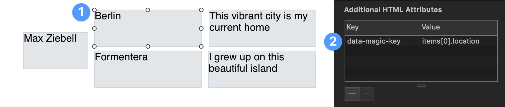
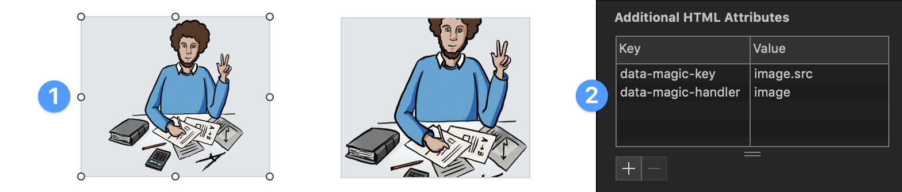
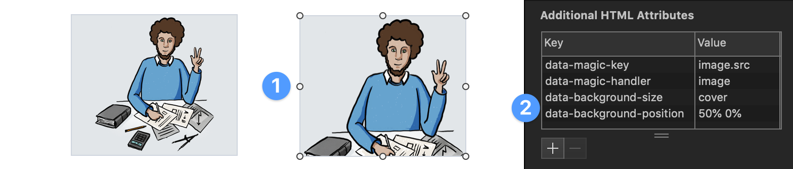

# Hype Data Magic


<sup>The cover artwork is not hosted in this repository and &copy;opyrighted by Max Ziebell</sup>

This is Hype DataMagic, it allows you to easily add and handle data in your Tumult Hype documents (with live preview).

## Usage

### Install Hype Data Magic

This step is effortless if you use the CDN version mentioned at the end of this document. Just copy and paste the following line into your Head HTML:

```html
<script src="https://cdn.jsdelivr.net/gh/worldoptimizer/HypeDataMagic/HypeDataMagic.min.js"></script>
```

You're done installing Hype Data Magic <sup>1</sup>.

### Basic example to set data:

Open Head HTML and add a script section to it `<script></script>`. Then add the following command between the tags:

``` javascript
HypeDataMagic.setData{
	name: 'Max Ziebell',
	hello: 'world',
});
```

### Bind data to your Hype document:


1. Select a rectangle on stage and goto the **Identity** panel 
2. Add a new key to the **Additional HTML Attributes** called `data-magic-key` and set the value to a key we used in `setData` like *name*

You should now see a preview of the data in your Hype document. From now on, when you edit the data in your Head HTML and change back to the scene you will see that updated reflected immediately. This also works when previewing the Hype document and even works if you update the data in the browser console while previewing.

### Basic example to set and bind data with nested objects:

```javascript
HypeDataMagic.setData{
	name: 'Max Ziebell',
	hello: 'world',
	items: [
		{
			location: 'Berlin',
			relation: 'This vibrant city is my current home'
		},
		{
			location: 'Formentera',
			relation: 'I grew up on this beautiful island'
		},
	],
});
```

**Binding nested data** is as simple as the previous example as the data-magic-key is parsed using a simple JavaScript array/object notation. 



1. Select an recangle on stage and goto the **Identity** panel
2. This time we set the key to `items[0].location` as `items` is an array we chose the first branch (indexing starts at `0`) and the property `location`

You should now see a preview of the nested data in your rectangle. To see all the data just repeat the last steps and change the property to `relation` and for the other rectangles just change the index from `0` to `1`.

### Using data handler in Hype Data Magic

What you just experienced was the default data handler (text). It sets the inner HTML content of your rectangle to whatever string it finds when looking up the `data-magic-key` previously set using `HypeDataMagic.setData`. 

There is another built in data handler called `image` and in this example we will look at how we can easily set it up and use it in our Hype document.

First we need example data with a URL pointing to an image <sup>2</sup>.

```javascript
HypeDataMagic.setData{
  image:{
		src:'https://maxziebell.de/wp-content/uploads/2018/11/Max-Ziebell-Konzept-3-e1543533327368.png'
	},
});
```




1. Select an recangle on stage and goto the **Identity** panel
2. Assign the `data-magic-key` as in the previous nested example to `image.src`. This time there is no array involved, so we can choose the `image` object and directly the `src` property. The new part is to assign the `data-magic-handler` and set it to `image`.

You should now see the image inside the rectangle. The image is set to be contained in the rectangle meaning it scales with the dimensions of the rectangle <sup>3</sup>.

### The image data handler and its options



1. Select another rectangle and repeat the steps of assigning the `data-magic-key` and the `data-magic-handler`. 
2. Now we can explore some options you can use when assigning the image data handler:
   *  `data-background-size` can be set to `cover` and defaults to `contain` if not set <sup>4</sup>.
   *  `data-background-position`  can be used to set the *focal point* if the size is set to `cover` <sup>5</sup>. In this example we focus on `50%` from the left and `0%` from the top.

**Version-History:**  
`1.0	Initial release under MIT `   

## Documentation

There is a [JSDoc](https://en.wikipedia.org/wiki/JSDoc) based documentation of the functions at https://doxdox.org/worldoptimizer/HypeDataMagic

Content Delivery Network (CDN)
--

Latest version can be linked into your project using the following in the head section of your project:

**Version with IDE-Preview:**

```html
<script src="https://cdn.jsdelivr.net/gh/worldoptimizer/HypeDataMagic/HypeDataMagic.min.js"></script>
```

**Version without IDE-Preview (saves some kilobytes in final delivery, if necessary):**

```html
<script src="https://cdn.jsdelivr.net/gh/worldoptimizer/HypeDataMagic/HypeDataMagic.prod.min.js"></script>
```

Optionally you can also link a SRI version or specific releases. 
Read more about that on the JsDelivr (CDN) page for this extension at https://www.jsdelivr.com/package/gh/worldoptimizer/HypeDataMagic

Learn how to use the latest extension version and how to combine extensions into one file at
https://github.com/worldoptimizer/HypeCookBook/wiki/Including-external-files-and-Hype-extensions

---

**Footnotes:**

<sup>*1. If you don't want to use the CDN Version, please download the repository and add the file -`HypeDataMagic.min.js` to your resource panel. Make sure it's added to Head HTML (Hype default).*</sup>

*<sup>2. If you followed the previous example you can also just add the `image` to the existing data also we actually don't need a nested object  like`image.src` and the URL could also just be directly assigned to the`image` key. This example uses nesting because there are some optional features doing it this way.</sup>*

*<sup>3. Be aware that Hype Data Magic doesn't include any preloading meaning that the image starts loading when you set the data or reach the scene when previewing.</sup>*

*<sup>4. This options mirrors the CSS property background-size. Read more about possible values at https://www.w3schools.com/cssref/css3_pr_background-size.asp .</sup>*

*<sup>5. This options mirrors the CSS property background-position. Read more about possible values at https://www.w3schools.com/cssref/pr_background-position.asp .</sup>*